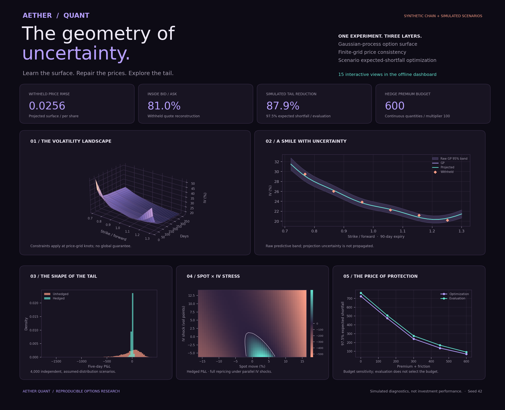

# Aether Quant

### The geometry of uncertainty.

**An options research workbench that connects probabilistic machine learning, constrained price geometry, and portfolio tail-risk optimization.**

Fit a volatility surface from an option-chain snapshot, challenge it with withheld quotes and an SVI benchmark, repair finite-grid static inconsistencies, then study what a limited hedge budget can change. Explore the entire experiment through **15 interactive Plotly views**, delivered as one offline HTML file.



The bundled demo uses a **synthetic option chain and simulated risk scenarios**. Its results are research diagnostics, not investment performance.

## Start in three commands

Python 3.10+ is required. From the repository directory:

```bash
python -m venv .venv
source .venv/bin/activate
python -m pip install -e .
```

Run the complete experiment:

```bash
python -m aether_quant demo
```

Open **`artifacts/demo/dashboard.html`** in your browser. The report embeds Plotly, works offline, and needs no API key or server. Generating it requires the Python dependencies. On Windows, activate with `.venv\Scripts\activate`.

## Three connected research layers

| Layer | Implementation | What you can inspect |
|---|---|---|
| Learn | Gaussian process on log total variance, anisotropic RBF kernel and learned observation noise | IV surface, raw predictive bands, withheld reconstruction, SVI comparison |
| Constrain | Least-squares price projection with linear inequalities | Call bounds, digital bounds, convex strike slices, calendar ordering, repair cost |
| Hedge | Sparse expected-shortfall linear program and independent scenario evaluation | P&L distribution, tail curves, selected hedge, joint spot/IV stress, budget sensitivity |

The project tests whether the model respects useful structure. It does not assume that a more complex model must beat a conventional one.

## The research atlas

1. **Volatility landscape** — rotate the surface; switch between raw, projected, and uncertainty width.
2. **Smile explorer** — change expiry and inspect training quotes, withheld quotes, and GP bands.
3. **Repair map** — see where the constrained projection changes prices.
4. **Static diagnostics** — compare violations before and after projection.
5. **Withheld reconstruction** — observed versus fitted prices for three approaches.
6. **Benchmark board** — price RMSE for GP, projected GP, and SVI.
7. **State-price geometry** — inspect a finite-difference density proxy.
8. **Digital probabilities** — inspect negative normalized-call slopes.
9. **Tail distribution** — compare simulated portfolio P&L before and after hedging.
10. **Expected-shortfall curve** — compare losses at several confidence levels.
11. **Hedge allocation** — inspect the optimizer's continuous contract quantities.
12. **Spot × IV stress** — switch between hedged and unhedged repricing maps.
13. **Premium frontier** — inspect tail-risk sensitivity to the premium budget.
14. **Scenario dependence** — examine the assumed spot/volatility relationship.
15. **Data coverage** — locate the quotes supporting the model.

## Use your own chain

The importer accepts a synchronized snapshot of **European call options**, quoted per underlying share. Do not feed American equity options into this European pricing model without addressing early exercise and dividends separately.

| CSV column | Meaning |
|---|---|
| `days` | Positive calendar days to expiry, using ACT/365 |
| `strike` | Positive strike in the same currency as spot |
| `bid` | Positive bid, per share |
| `ask` | Ask greater than or equal to bid, per share |

The chain needs at least **3 expiries and 12 distinct strikes per expiry**, with a common forward-moneyness interval at least 0.1 wide. Quotes must be finite and midpoints must satisfy European call bounds. Bad quotes cause a clear error; they are not silently removed.

```bash
python -m aether_quant run \
  --chain your-european-calls.csv \
  --spot 100 --rate 0.03 --dividend 0.00 \
  --positions examples/positions.json \
  --budget 600 --out artifacts/my-chain
```

Rates and dividend yields are annual, continuously compounded, and constant over maturities. Importing real quotes changes the calibration data; **the risk scenario distribution remains an explicit simulation assumption**.

`examples/synthetic-chain.csv` lets you exercise the importer without market-data access:

```bash
python -m aether_quant run --chain examples/synthetic-chain.csv --spot 100
```

## Define a portfolio and hedge universe

`examples/positions.json` contains two arrays: `portfolio` and `hedges`. Each leg has `label`, `kind` (`call` or `put`), `strike_ratio`, `days`, and `quantity`. Strike ratio is relative to the initial spot, not the forward. Positive portfolio quantities are long; negative quantities are short. Each candidate hedge has quantity 1 because the optimizer chooses its final size.

The demo starts with two short 90-day calls, two short 90-day puts, and one long 180-day call. It chooses among three long option hedges, subject to a premium budget and a cap of five units per hedge. Option multiplier is 100; the horizon is five calendar days. Default positions require a surface spanning their maturities and moneyness. Entry points outside the calibration domain are rejected. Stressed points are clamped to the domain and counted in the audit.

**Hedge quantities are continuous.** Integer contracts, execution depth, margin, borrowing constraints, taxes, and portfolio liquidation costs are outside this prototype. Rounding a solution changes its budget and risk and requires a separate check.

## Reproducible outputs

Each successful run writes:

| File | Contents |
|---|---|
| `dashboard.html` | Self-contained interactive report |
| `metrics.json` | Data hash, seeds, dependency versions, model diagnostics, SVI parameters, risk audit |
| `chain.csv` | The four input columns used in the run |
| `prepared-quotes.csv` | Normalized quotes, inferred IVs, and split membership |
| `heldout-quotes.csv` | Held-out prices and model reconstructions |
| `surface.npz` | Raw and projected surfaces and GP bands; no pickle required |
| `risk.npz` | Evaluation scenarios, P&L arrays, premiums, and hedge weights |
| `evaluation-scenarios.csv` | Readable scenario-level evaluation |
| `positions.json` | Portfolio and hedge specification |
| `frontier.json` | Premium-budget sensitivity results |

Seed 42 is the default. Calibration uses 133 training and 42 withheld quotes in the demo; the hedge uses 1,500 optimization scenarios and 4,000 independent evaluation scenarios. The evaluation seed is the training seed + 1009. Numerical values can vary slightly across dependency versions and platforms. See [the recorded demo results](docs/demo-results.json) for the checked run.

Generated run directories are ignored by Git. No credentials, downloaded market data, or binary serialized Python objects are required.

## Research boundaries

- **Interpolation, not forecasting.** Interior strike holdouts test reconstruction within one snapshot. They do not test future returns, new market regimes, or leave-expiry-out generalization.
- **A finite grid, not a global certificate.** The projection constrains normalized prices at reported knots. IV interpolation and stressed repricing do not inherit a proof of global absence of arbitrage. Density proxies omit tails.
- **Model uncertainty, not calibrated coverage.** GP bands are transformed raw predictive intervals for log total variance. Projection uncertainty is not propagated.
- **A baseline with its own assumptions.** SVI uses three training-only restarts and positive total variance, without butterfly or calendar constraints. Neither model is guaranteed to win.
- **Simulated risk, not a backtest.** Student-t returns, occasional jumps, and correlated IV shocks are assumed rather than historically calibrated. Independent scenarios reduce optimization-sample reuse; they do not eliminate distributional model risk.
- **Limited friction.** A flat one-currency-unit cost per hedge unit and risk-free financing are modeled. Bid/ask data are used for evaluation, not execution or GP weighting.

See [methodology](docs/METHODOLOGY.md) for equations, validation design, and limitations.

## Development

```bash
python -m unittest discover -s tests -v
```

The numerical tests cover put-call parity, IV inversion, invalid quotes, split integrity, heldout-target invariance, price-grid repair, exact empirical tail weighting, hedge budget constraints, and scenario seed separation. CI runs the tests and a full report on Python 3.10 and 3.12.

Regenerate the static board after a demo run:

```bash
python -m pip install -e '.[preview]'
python scripts/render_preview.py
```

## Push your copy

Create an empty `aether-quant` repository on GitHub. The downloadable archive already contains a local commit and this origin; verify with `git remote -v`, then:

```bash
git push -u origin main
```

For a fresh source directory without Git history:

```bash
git init -b main
git add .
git commit -m "Build Aether Quant research workbench"
git remote add origin git@github.com:b17w1z4rd/aether-quant.git
git push -u origin main
```

MIT licensed. Designed for research and extension.
